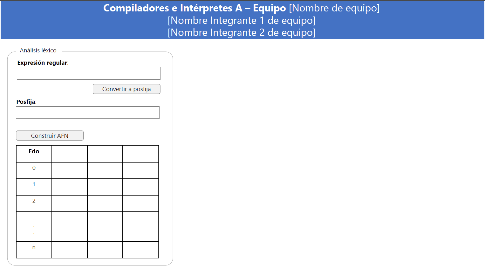

# Compiladores_A-Shakespares

## Preparacion del proyecto(viernes 11 Septiembre)==>(*):
Permitir que el usuario, a través de un control de carga de archivo (FileUpload, <input type="file">, etc.), seleccione un archivo  de texto (*.txt) e internamente procesarlo para finalmente mostrar el contenido en un control de entrada de texto (TextBox, <input type="text">, etc.).

## 1º avance (Jueves 24 Septiembre)==>(*):
En una entrada de texto el usuario podrá capturar una expresión regular. Al dar clic en el botón de "Convertir a posfija" se llevará a cabo de manera interna la conversión y, se mostrará el resultado.
El alfabeto sobre el que se trabajará es: Σ = { a, b, c, d, e, f, g, ... z, 0, 1, 2, 3, ... 9 }
### Ejemplo de interfaz:

## 2º avance (Viernes 9 Octubre)==>():
Se agregará un nuevo botón "Construir AFN", el cual, al darle clic, de manera interna y en base al algoritmo de McNaughton - Yamada - Thompson, se construirá el Autómata Finito No Determinista. En pantalla se mostrará la Tabla de Transiciones.
### Ejemplo de interfaz:

## 3º avance (Viernes 23 Octubre)==>():
Se agregará un nuevo botón "Construir AFD", el cual, al darle clic, de manera interna y en base al algoritmo de construcción de subconjuntos, se construirá el Autómata Finito Determinista. En pantalla se mostrará la Tabla de Transiciones.
### Ejemplo de interfaz:

## 4º avance (Viernes 6 Noviembre)==>():
Se agregará una nueva entrada de texto (para lexema) y un nuevo botón "Validar". Al darle clic, de manera interna se realizará un recorrido sobre el AFD para determinar si pertenece o no al lenguaje de la expresión regular.
### Ejemplo de interfaz:

## 5º avance (Viernes 19 Noviembre)==>():
Se tendrán 2 entradas de texto, una para la expresión regular de identificador y otra para la de número.
Se agregará una nueva entrada de texto multilínea para captura de programa en lenguaje TINY y, un botón "Clasifica tokens". Al dar clic sobre el botón, realizará la clasificación de tokens del programa capturado por el usuario. Dicha clasificación se mostrará en una tabla.

### Ejemplo de interfaz:

Si en el proceso se detecta uno o mas tokens que no son válidos, se deberá mostrar en pantalla que existe error léxico y cuál(es) son.
### Nota:
Un programa TINY tiene una estructura muy simple: es simplemente una secuencia de sentencias separadas mediante signos de punto y coma en una sintaxis semejante a la de ADA o Pascal. No hay procedimientos ni declaraciones. Todas las variables son variables enteras, y las variables son declaradas simplemente al asignar valores a las mismas.

Es importante recordar los tokens del lenguaje TINY:
|Palabras reservadas   |Simbolos especiales   |Otros  |
|---|---|---|
|if  | +  | numero( 1 o más digitos)   |
|then  | -   |identificador(1 o mas letras)   |
|else   | *  | **En nuestro caso dependendera de las expresiones regulares que asignemos   |
|end   | /  |   |
|repeat   | =   |   |
|until   | <   |   |
|read   | >   |   |
|write   | (  |   |
|   | )   |   |
|   | ; |   |
|   | := |   |

### Gramatica del lenguaje TINY:
+ programa -> secuencia-sent
+ secuencia-sent -> secuencia-sent ; sentencia | sentencia
+ sentencia -> sent-if | sent-repeat | sent-assign | sent-read | sent-write
+ sent-if -> if exp then secuencia-sent end | if exp then secuencia-sent else secuencia-sent end
+ sent-repeat -> repeat secuencia-sent until exp
+ sent-assign -> identificador := exp
+ sent-read -> read identificador
+ sent-write -> write exp
+ exp -> exp-simple op-comp exp-simple | exp-simple
+ op-comp -> < | > | =
+ exp-simple -> exp-simple opsuma term | term
+ opsuma -> + | -
+ term -> term opmult factor | factor
+ opmult -> * | /
+ factor -> ( exp ) | numero | identificador

## 6º avance (Viernes 4 Diciembre)==>():
Se agregará una sección para Análisis Sintáctico LR(0). 

Se mostrará un botón "Construir Colección LR(0) Canónica", al cual, al darle click, internamente construirá el autómata LR(0) en base a la gramática TINY.

Mostrará como resultado una tabla de transiciones del AFD resultante, así como un listado del contenido de los elementos de cada estado.

### Ejemplo de interfaz:

### Gramatica del lenguaje TINY:

+programa -> secuencia-sent
+secuencia-sent -> secuencia-sent ; sentencia | sentencia
+sentencia -> sent-if | sent-repeat | sent-assign | sent-read | sent-write
+sent-if -> if exp then secuencia-sent end | if exp then secuencia-sent else secuencia-sent end
+sent-repeat -> repeat secuencia-sent until exp
+sent-assign -> identificador := exp
+sent-read -> read identificador
+sent-write -> write exp
+exp -> exp-simple op-comp exp-simple | exp-simple
+op-comp -> < | > | =
+exp-simple -> exp-simple opsuma term | term
+opsuma -> + | -
+term -> term opmult factor | factor
+opmult -> * | /
+factor -> ( exp ) | numero | identificador

## 7º avance (Viernes 18 Diciembre)==>():

Al botón actual de "Construir Colección LR(0) Canónica" le agregaremos " y Tabla de Análisis Sintáctico LR", al cual, al darle clic, internamente, además de construir el autómata LR(0), también se deberá construir la tabla de Análisis Sintáctico LR en base a la gramática TINY, y se imprimirá en pantalla.

### Ejemplo de interfaz:

### Gramatica del lenguaje TINY:

+programa -> secuencia-sent
+secuencia-sent -> secuencia-sent ; sentencia | sentencia
+sentencia -> sent-if | sent-repeat | sent-assign | sent-read | sent-write
+sent-if -> if exp then secuencia-sent end | if exp then secuencia-sent else secuencia-sent end
+sent-repeat -> repeat secuencia-sent until exp
+sent-assign -> identificador := exp
+sent-read -> read identificador
+sent-write -> write exp
+exp -> exp-simple op-comp exp-simple | exp-simple
+op-comp -> < | > | =
+exp-simple -> exp-simple opsuma term | term
+opsuma -> + | -
+term -> term opmult factor | factor
+opmult -> * | /
+factor -> ( exp ) | numero | identificador

## Proyecto final (Jueves 7 Enero)==>():

